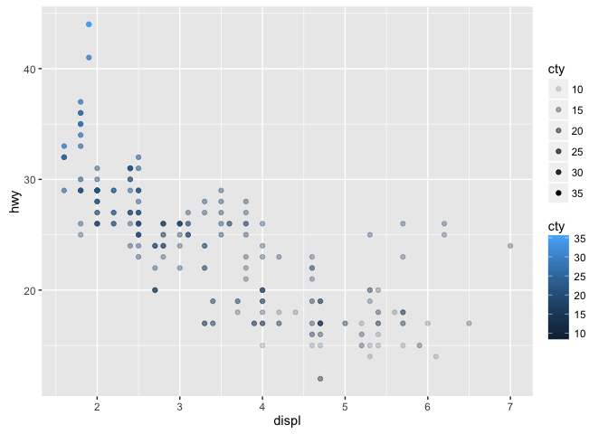
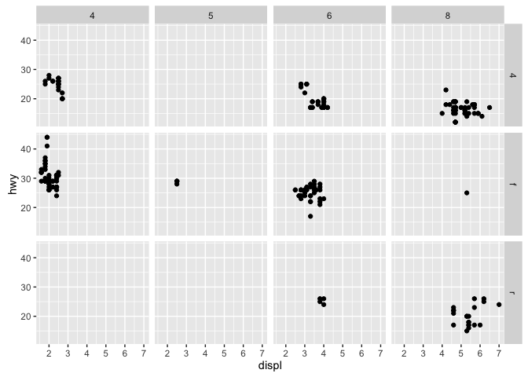

# 4_26_17_homework
Allie Gaudinier  
4/25/2017  
### Homework for April 26th, 2017
###Sections 3.1- 3.51 in R for Data Science

Install the tidyverse package once:

install.packages("tidyverse")


```r
library(tidyverse)
```

```
## Loading tidyverse: ggplot2
## Loading tidyverse: tibble
## Loading tidyverse: tidyr
## Loading tidyverse: readr
## Loading tidyverse: purrr
## Loading tidyverse: dplyr
```

```
## Conflicts with tidy packages ----------------------------------------------
```

```
## filter(): dplyr, stats
## lag():    dplyr, stats
```

```r
summary(mpg)
```

```
##  manufacturer          model               displ            year     
##  Length:234         Length:234         Min.   :1.600   Min.   :1999  
##  Class :character   Class :character   1st Qu.:2.400   1st Qu.:1999  
##  Mode  :character   Mode  :character   Median :3.300   Median :2004  
##                                        Mean   :3.472   Mean   :2004  
##                                        3rd Qu.:4.600   3rd Qu.:2008  
##                                        Max.   :7.000   Max.   :2008  
##       cyl           trans               drv                 cty       
##  Min.   :4.000   Length:234         Length:234         Min.   : 9.00  
##  1st Qu.:4.000   Class :character   Class :character   1st Qu.:14.00  
##  Median :6.000   Mode  :character   Mode  :character   Median :17.00  
##  Mean   :5.889                                         Mean   :16.86  
##  3rd Qu.:8.000                                         3rd Qu.:19.00  
##  Max.   :8.000                                         Max.   :35.00  
##       hwy             fl               class          
##  Min.   :12.00   Length:234         Length:234        
##  1st Qu.:18.00   Class :character   Class :character  
##  Median :24.00   Mode  :character   Mode  :character  
##  Mean   :23.44                                        
##  3rd Qu.:27.00                                        
##  Max.   :44.00
```

```r
#learn more about this dataset
?mpg

#plot displ by hwy
ggplot(data = mpg) +
  geom_point(mapping = aes(x = displ, y = hwy))
```

<!-- -->

```r
#general code for basic ggplot functions
#ggplot(data = <DATA>) + 
  #<GEOM_FUNCTION>(mapping = aes(<MAPPINGS>))
```

##3.2.4 Exercises

```r
ggplot(data = mpg)
```

<!-- -->

```r
#this produced an empty plot

#check number of rows and columns in mtcars
nrow(mtcars)
```

```
## [1] 32
```

```r
ncol(mtcars)
```

```
## [1] 11
```

```r
?mpg
#drv. f = front-wheel drive, r = rear wheel drive, 4 = 4wd

ggplot(data = mpg) +
  geom_point(mapping = aes(x = hwy, y = cyl))
```

<!-- -->

```r
ggplot(data = mpg) +
  geom_point(mapping = aes(x = class, y = drv))
```

<!-- -->

```r
##this plot shows that there is fwd, rwd, and 4wd for the types of cars
```

####Color by car class
ggplot(data = mpg) + 
  geom_point(mapping = aes(x = displ, y = hwy, color = class))

#### Warning: Using size for a discrete variable is not advised.
ggplot(data = mpg) + 
  geom_point(mapping = aes(x = displ, y = hwy, size = class))

####alpha aesthetic controls the transparency of the points
ggplot(data = mpg) + 
  geom_point(mapping = aes(x = displ, y = hwy, alpha = class))

####shape of the points
ggplot(data = mpg) + 
  geom_point(mapping = aes(x = displ, y = hwy, shape = class))

ggplot2 will only use six shapes at a time. By default, additional groups will go unplotted when you use the shape aesthetic.

make all the points blue
ggplot(data = mpg) + 
  geom_point(mapping = aes(x = displ, y = hwy), color = "blue")

Figure 3.1 R has 25 built in shapes that are identified by numbers

##3.3.1 Exercises


```r
#1. 
#ggplot(data = mpg) + 
  #geom_point(mapping = aes(x = displ, y = hwy, color = "blue"))
#to make all points  = "blue" should be geom_point(mapping = aes(x = displ, y = hwy), color = "blue")

#2.
#Categorical: manufacturer, model, trans, year, cyl, class, fl, drv
#   Continuous: displ, cty, hwy
str(mpg)
```

```
## Classes 'tbl_df', 'tbl' and 'data.frame':	234 obs. of  11 variables:
##  $ manufacturer: chr  "audi" "audi" "audi" "audi" ...
##  $ model       : chr  "a4" "a4" "a4" "a4" ...
##  $ displ       : num  1.8 1.8 2 2 2.8 2.8 3.1 1.8 1.8 2 ...
##  $ year        : int  1999 1999 2008 2008 1999 1999 2008 1999 1999 2008 ...
##  $ cyl         : int  4 4 4 4 6 6 6 4 4 4 ...
##  $ trans       : chr  "auto(l5)" "manual(m5)" "manual(m6)" "auto(av)" ...
##  $ drv         : chr  "f" "f" "f" "f" ...
##  $ cty         : int  18 21 20 21 16 18 18 18 16 20 ...
##  $ hwy         : int  29 29 31 30 26 26 27 26 25 28 ...
##  $ fl          : chr  "p" "p" "p" "p" ...
##  $ class       : chr  "compact" "compact" "compact" "compact" ...
```

```r
#3. #color continuous variable
ggplot(data = mpg) + 
  geom_point(mapping = aes(x = displ, y = hwy, color = cty))
```

<!-- -->

```r
#4. #map two aes to a variable - it works but looks weird
ggplot(data = mpg) + 
  geom_point(mapping = aes(x = displ, y = hwy, color = cty, alpha = cty))
```

<!-- -->

```r
#5. what does stroke in aes do? modifies the width of the border
#this only works with some shapes - those that have borders
?geom_point
ggplot(data = mpg) + 
  geom_point(mapping = aes(x = displ, y = hwy, stroke = 1))
```

<!-- -->

```r
#6. makes a graph with true and false colors 
ggplot(data = mpg) + 
  geom_point(mapping = aes(x = displ, y = hwy, colour = displ < 5))
```

<!-- -->

###3.5.1 Exercises


```r
#1. You can't facet on a continuous variable because it can't be broken into categories or segments

#2. 
ggplot(data = mpg) + 
  geom_point(mapping = aes(x = drv, y = cyl))
```

<!-- -->

```r
#this displays the displ by hwy at the in seperate graphs that have been designated by the drv ~ cyl formula
ggplot(data = mpg) + 
  geom_point(mapping = aes(x = displ, y = hwy)) + 
  facet_grid(drv ~ cyl)
```

<!-- -->

```r
#3. The plots are formed by only one category (drv or cyl)
ggplot(data = mpg) + 
  geom_point(mapping = aes(x = displ, y = hwy)) +
  facet_grid(drv ~ .)
```

<!-- -->

```r
ggplot(data = mpg) + 
  geom_point(mapping = aes(x = displ, y = hwy)) +
  facet_grid(. ~ cyl)
```

<!-- -->

```r
#4. # It is easier to see the distribution of datapoints in the individual plots, 
#but it is harder to make comparisons
# A larger dataset would make it harder to make comparisons if every point is plotted
#on the came graph
ggplot(data = mpg) + 
  geom_point(mapping = aes(x = displ, y = hwy)) + 
  facet_wrap(~ class, nrow = 2)
```

<!-- -->

```r
#5.
#?facet_wrap - this goes until all the plots for the categories in this facet are plotted
#nrow = number of rows, ncol = # columns - this controls the number of 
#rows or columns in the facet plot
#?facet_grid
#facet_grid doesn't have this because it uses the number of things in the category you are telling it to facet by. 

#6. Fits better with standard pages - can fit more columns than rows.
```

### Notes from class
`formats text like code but doesn't run it like code`
specify figure width and height (dimensions in inches)
`{r, fig.height = 6, fig.width = 6}`

only color one of the class types
ggplot(data = mpg) + 
  geom_point(mapping = aes(x = displ, y = hwy, color = class == "compact"))

set free scales in the facet wrap - this gets rid of the same scale for all plots, 
this is good to look at individual plots but makes comparing between plots difficult


plot.1 <- ggplot

plot.1 + (add more features to the plot)
