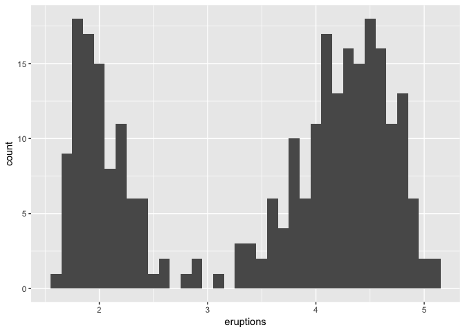
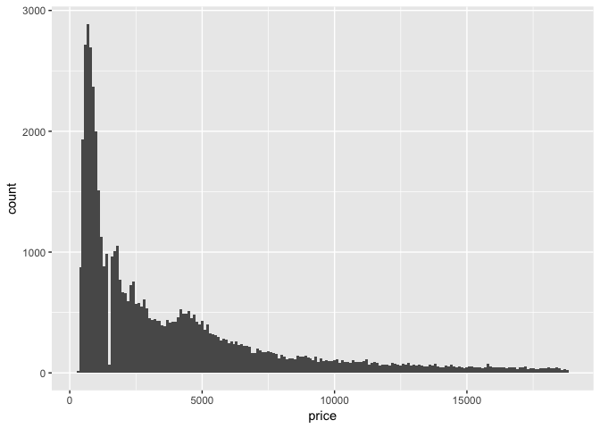
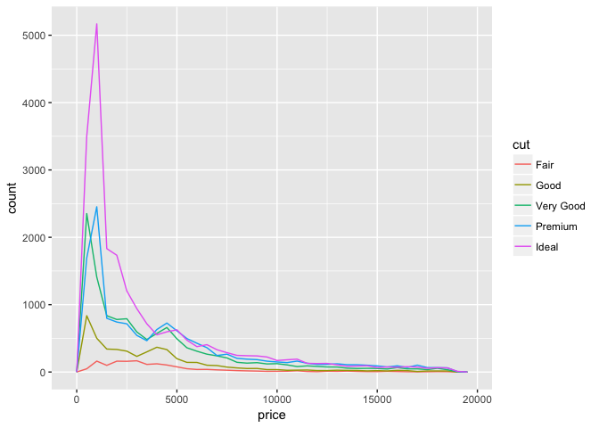
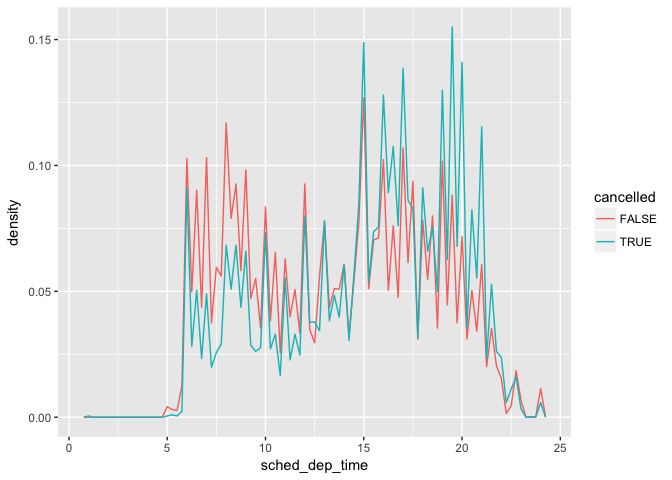
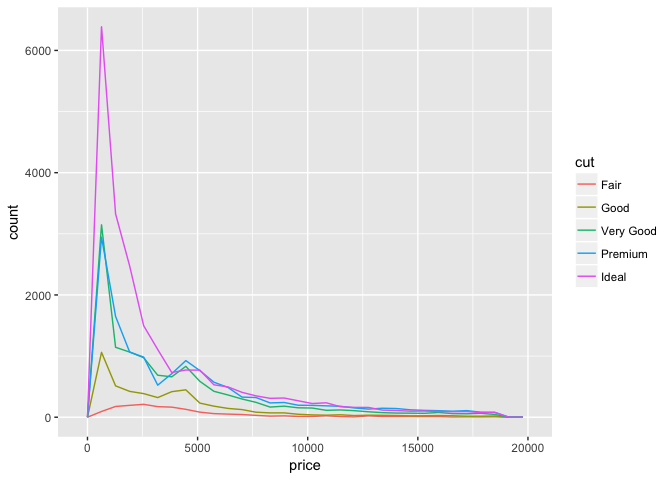
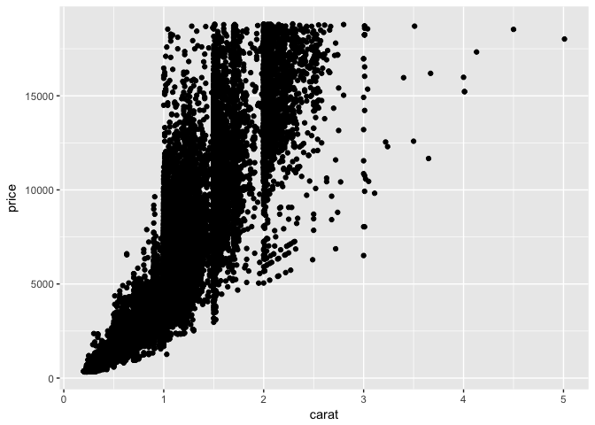

# 5_24_17_homework
Allie Gaudinier  
5/23/2017  
##7.1 - 7.3

```r
library(tidyverse)
```

```
## Loading tidyverse: ggplot2
## Loading tidyverse: tibble
## Loading tidyverse: tidyr
## Loading tidyverse: readr
## Loading tidyverse: purrr
## Loading tidyverse: dplyr
```

```
## Conflicts with tidy packages ----------------------------------------------
```

```
## filter(): dplyr, stats
## lag():    dplyr, stats
```

```r
library(ggplot2)

ggplot(data = diamonds) +
  geom_bar(mapping = aes(x = cut))
```

<!-- -->

```r
diamonds %>% 
  count(cut)
```

```
## # A tibble: 5 × 2
##         cut     n
##       <ord> <int>
## 1      Fair  1610
## 2      Good  4906
## 3 Very Good 12082
## 4   Premium 13791
## 5     Ideal 21551
```

```r
ggplot(data = diamonds) +
  geom_histogram(mapping = aes(x = carat), binwidth = 0.5)
```

<!-- -->

```r
diamonds %>% 
  count(cut_width(carat, 0.5))
```

```
## # A tibble: 11 × 2
##    `cut_width(carat, 0.5)`     n
##                     <fctr> <int>
## 1             [-0.25,0.25]   785
## 2              (0.25,0.75] 29498
## 3              (0.75,1.25] 15977
## 4              (1.25,1.75]  5313
## 5              (1.75,2.25]  2002
## 6              (2.25,2.75]   322
## 7              (2.75,3.25]    32
## 8              (3.25,3.75]     5
## 9              (3.75,4.25]     4
## 10             (4.25,4.75]     1
## 11             (4.75,5.25]     1
```

```r
smaller <- diamonds %>% 
  filter(carat < 3)
  
ggplot(data = smaller, mapping = aes(x = carat)) +
  geom_histogram(binwidth = 0.1)
```

<!-- -->

```r
ggplot(data = smaller, mapping = aes(x = carat, colour = cut)) +
  geom_freqpoly(binwidth = 0.1)
```

<!-- -->

```r
ggplot(data = smaller, mapping = aes(x = carat)) +
  geom_histogram(binwidth = 0.01)
```

<!-- -->

```r
ggplot(data = faithful, mapping = aes(x = eruptions)) + 
  geom_histogram(binwidth = 0.25)
```

<!-- -->

```r
ggplot(data = faithful, mapping = aes(x = eruptions)) + 
  geom_histogram(binwidth = 0.1)
```

<!-- -->

```r
ggplot(diamonds) + 
  geom_histogram(mapping = aes(x = y), binwidth = 0.5)
```

<!-- -->

```r
ggplot(diamonds) + 
  geom_histogram(mapping = aes(x = y), binwidth = 0.5) +
  coord_cartesian(ylim = c(0, 50))
```

<!-- -->


##7.3.4 Exercises

1. Explore the distribution of each of the x, y, and z variables in diamonds. What do you learn? Think about a diamond and how you might decide which dimension is the length, width, and depth.
The y and z datasets probably have input errors.
Decide which dimensions are length, width and depth by looking at the plots. 
Guess: x is depth, y and z are length and width

```r
ggplot(data = diamonds) +
  geom_bar(mapping = aes(x = x))
```

<!-- -->

```r
ggplot(data = diamonds) +
  geom_bar(mapping = aes(x = y))
```

<!-- -->

```r
ggplot(data = diamonds) +
  geom_bar(mapping = aes(x = z))
```

<!-- -->

2. Explore the distribution of price. Do you discover anything unusual or surprising? (Hint: Carefully think about the binwidth and make sure you try a wide range of values.)
Some of the diamonds are super expensive. They go up to about 18,000 - but most are around a few hundred. 


```r
ggplot(data = diamonds) +
  geom_histogram(mapping = aes(x = price), binwidth = 100)
```

<!-- -->

```r
ggplot(data = diamonds) +
  geom_histogram(mapping = aes(x = price), binwidth = 500)
```

<!-- -->

3. How many diamonds are 0.99 carat? How many are 1 carat? What do you think is the cause of the difference? Difference is due to diamond quality - almost 1 carat isn't 1 carat. 


```r
diamonds %>% 
  count(carat == 0.99)
```

```
## # A tibble: 2 × 2
##   `carat == 0.99`     n
##             <lgl> <int>
## 1           FALSE 53917
## 2            TRUE    23
```

```r
diamonds %>% 
  count(carat == 1)
```

```
## # A tibble: 2 × 2
##   `carat == 1`     n
##          <lgl> <int>
## 1        FALSE 52382
## 2         TRUE  1558
```

4. Compare and contrast coord_cartesian() vs xlim() or ylim() when zooming in on a histogram. What happens if you leave binwidth unset? What happens if you try and zoom so only half a bar shows?


```r
#explore x lim, make it much lower
ggplot(diamonds) + 
  geom_histogram(mapping = aes(x = y), binwidth = 0.5) +
  coord_cartesian(xlim = c(0, 13))
```

<!-- -->

```r
#no binwidth
ggplot(diamonds) + 
  geom_histogram(mapping = aes(x = y)) +
  coord_cartesian(xlim = c(0, 13))
```

```
## `stat_bin()` using `bins = 30`. Pick better value with `binwidth`.
```

<!-- -->

```r
#explore x and y lim to zoom in  
ggplot(diamonds) + 
  geom_histogram(mapping = aes(x = y), binwidth = 0.1) +
  coord_cartesian(ylim = c(0, 500), xlim = c(4, 10))
```

<!-- -->


##7.4  Missing values


```r
diamonds2 <- diamonds %>% 
  mutate(y = ifelse(y < 3 | y > 20, NA, y))

ggplot(data = diamonds2, mapping = aes(x = x, y = y)) + 
  geom_point(na.rm = TRUE)
```

<!-- -->

```r
library(nycflights13)

nycflights13::flights %>% 
  mutate(
    cancelled = is.na(dep_time),
    sched_hour = sched_dep_time %/% 100,
    sched_min = sched_dep_time %% 100,
    sched_dep_time = sched_hour + sched_min / 60
  ) %>% 
  ggplot(mapping = aes(sched_dep_time)) + 
    geom_freqpoly(mapping = aes(colour = cancelled), binwidth = 1/4)
```

<!-- -->

##7.4.1 Exercises

1. What happens to missing values in a histogram? What happens to missing values in a bar chart? Why is there a difference? - They look the same to me!

```r
ggplot(data = diamonds) + 
  geom_bar(mapping = aes(x = carat), na.rm = TRUE)
```

<!-- -->

```r
ggplot(data = diamonds) +
  geom_histogram(mapping = aes(x = carat), binwidth = 0.01, na.rm = TRUE)
```

<!-- -->

2. What does na.rm = TRUE do in mean() and sum()?
It ignores the NAs'


```r
diamonds %>%
  summarise(mean(price, na.rm = TRUE))
```

```
## # A tibble: 1 × 1
##   `mean(price, na.rm = TRUE)`
##                         <dbl>
## 1                      3932.8
```

```r
diamonds %>%
  summarise(sum(carat, na.rm = TRUE))
```

```
## # A tibble: 1 × 1
##   `sum(carat, na.rm = TRUE)`
##                        <dbl>
## 1                   43040.87
```

##7.5 Covariation


```r
ggplot(data = diamonds, mapping = aes(x = price)) + 
  geom_freqpoly(mapping = aes(colour = cut), binwidth = 500)
```

<!-- -->

```r
ggplot(data = diamonds, mapping = aes(x = price, y = ..density..)) + 
  geom_freqpoly(mapping = aes(colour = cut), binwidth = 500)
```

<!-- -->

```r
ggplot(data = diamonds, mapping = aes(x = cut, y = price)) +
  geom_boxplot()
```

<!-- -->

```r
ggplot(data = diamonds, mapping = aes(x = reorder(cut, price, FUN = median), y = price)) +
  geom_boxplot()
```

<!-- -->

```r
ggplot(data = mpg) +
  geom_boxplot(mapping = aes(x = reorder(class, hwy, FUN = median), y = hwy))
```

<!-- -->

```r
ggplot(data = mpg) +
  geom_boxplot(mapping = aes(x = reorder(class, hwy, FUN = median), y = hwy)) +
  coord_flip()
```

<!-- -->

##7.5.1.1 Exercises

1. Use what you’ve learned to improve the visualisation of the departure times of cancelled vs. non-cancelled flights.


```r
nycflights13::flights %>% 
mutate(
    cancelled = is.na(dep_time),
    sched_hour = sched_dep_time %/% 100,
    sched_min = sched_dep_time %% 100,
    sched_dep_time = sched_hour + sched_min / 60
  ) %>% 
  ggplot(mapping = aes( x = sched_dep_time, y = ..density..)) + 
    geom_freqpoly(mapping = aes(colour = cancelled), binwidth = 1/4)
```

<!-- -->

2. What variable in the diamonds dataset is most important for predicting the price of a diamond? How is that variable correlated with cut? Why does the combination of those two relationships lead to lower quality diamonds being more expensive?

```r
ggplot(diamonds, mapping = aes(x = price, y = carat)) +
  geom_point(mapping = aes(color = clarity))
```

<!-- -->

3. Install the ggstance package, and create a horizontal boxplot. How does this compare to using coord_flip()? Input is backwards, legend is flipped in the ggstance
install.packages("ggstance")

```r
ggplot(mpg, aes(class, hwy, fill = factor(cyl))) +
  geom_boxplot() +
  coord_flip()
```

<!-- -->

```r
library("ggstance")
```

```
## 
## Attaching package: 'ggstance'
```

```
## The following objects are masked from 'package:ggplot2':
## 
##     geom_errorbarh, GeomErrorbarh
```

```r
ggplot(mpg, aes(hwy, class, fill = factor(cyl))) +
  geom_boxploth()
```

<!-- -->

4. One problem with boxplots is that they were developed in an era of much smaller datasets and tend to display a prohibitively large number of “outlying values”. One approach to remedy this problem is the letter value plot. Install the lvplot package, and try using geom_lv() to display the distribution of price vs cut. What do you learn? How do you interpret the plots?
install.packages("lvplot")

```r
#library(lvplot)

#ggplot(diamonds, aes(price, cut)) +
  #geom_lv()
```

5. Compare and contrast geom_violin() with a facetted geom_histogram(), or a coloured geom_freqpoly(). What are the pros and cons of each method?

```r
ggplot(diamonds, mapping = aes(cut, price)) +
  geom_violin()
```

<!-- -->

```r
ggplot(diamonds, mapping = aes(price)) +
  geom_histogram() +
  facet_grid(cut ~ .)
```

```
## `stat_bin()` using `bins = 30`. Pick better value with `binwidth`.
```

<!-- -->

```r
ggplot(diamonds, mapping = aes(price)) +
  geom_freqpoly(mapping = aes(color = cut))
```

```
## `stat_bin()` using `bins = 30`. Pick better value with `binwidth`.
```

<!-- -->


6. If you have a small dataset, it’s sometimes useful to use geom_jitter() to see the relationship between a continuous and categorical variable. The ggbeeswarm package provides a number of methods similar to geom_jitter(). List them and briefly describe what each one does.
```
the method used for distributing points (quasirandom, pseudorandom, smiley or
frowney, beeswarm)
```

##7.5.2 Two categorical variables


```r
ggplot(data = diamonds) +
  geom_count(mapping = aes(x = cut, y = color))
```

<!-- -->

```r
diamonds %>% 
  count(color, cut) %>%  
  ggplot(mapping = aes(x = cut, y = color)) +
    geom_tile(mapping = aes(fill = n))
```

<!-- -->


##7.5.2.1 Exercises

1. How could you rescale the count dataset above to more clearly show the distribution of cut within colour, or colour within cut?
diamonds %>% 

```r
diamonds %>% 
  count(color, cut) %>%
  group_by(color) %>%
  mutate(prop = n / sum(n)) %>%
  ggplot(mapping = aes(x = color, y = cut)) +
  geom_tile(mapping = aes(fill = prop))
```

<!-- -->

2. Use geom_tile() together with dplyr to explore how average flight delays vary by destination and month of year. What makes the plot difficult to read? How could you improve it?


```r
nycflights13::flights %>%
  group_by(dest, month) %>%
  mutate(avgdelay = mean(dep_delay, na.rm = T)) %>%
  ggplot(mapping = aes(x = month, y= dest)) +
  geom_tile(mapping = aes(fill = avgdelay))
```

<!-- -->


3. Why is it slightly better to use aes(x = color, y = cut) rather than aes(x = cut, y = color) in the example above?
Doesn't change much - IMO

```r
diamonds %>% 
  count(color, cut) %>%  
  ggplot(mapping = aes(y = color, x = cut)) +
    geom_tile(mapping = aes(fill = n))
```

<!-- -->

##7.5.3 Two continuous variables


```r
ggplot(data = diamonds) +
  geom_point(mapping = aes(x = carat, y = price))
```

<!-- -->

```r
ggplot(data = diamonds) + 
  geom_point(mapping = aes(x = carat, y = price), alpha = 1 / 100)
```

<!-- -->

```r
ggplot(data = diamonds) +
  geom_bin2d(mapping = aes(x = carat, y = price))
```

<!-- -->

```r
#install.packages("hexbin")
library(hexbin)
ggplot(data = diamonds) +
  geom_hex(mapping = aes(x = carat, y = price))
```

<!-- -->

```r
ggplot(data = diamonds, mapping = aes(x = carat, y = price)) + 
  geom_boxplot(mapping = aes(group = cut_width(carat, 0.1)))
```

<!-- -->

```r
ggplot(data = diamonds, mapping = aes(x = carat, y = price)) + 
  geom_boxplot(mapping = aes(group = cut_number(carat, 20)))
```

<!-- -->

##7.5.3.1 Exercises

1. Instead of summarising the conditional distribution with a boxplot, you could use a frequency polygon. What do you need to consider when using cut_width() vs cut_number()? How does that impact a visualisation of the 2d distribution of carat and price?

```r
ggplot(data = diamonds, mapping = aes(x = price, y = ..density..)) + 
  geom_freqpoly(mapping = aes(color = cut_width(carat, 0.5)))
```

```
## `stat_bin()` using `bins = 30`. Pick better value with `binwidth`.
```

<!-- -->

```r
ggplot(data = diamonds, mapping = aes(x = price, y = ..density..)) + 
  geom_freqpoly(mapping = aes(color = cut_number(carat, 10)))
```

```
## `stat_bin()` using `bins = 30`. Pick better value with `binwidth`.
```

<!-- -->


2. Visualise the distribution of carat, partitioned by price.

```r
ggplot(data = diamonds, mapping = aes(x = price, y = carat)) + 
  geom_boxplot(mapping = aes(group = cut_width(price, 750))) +
  coord_flip()
```

<!-- -->

3. How does the price distribution of very large diamonds compare to small diamonds. Is it as you expect, or does it surprise you?

```r
diamonds %>%
  ggplot(mapping = aes(carat, price)) +
  geom_boxplot(mapping = aes(group = cut_width(price, 750))) +
  coord_flip()
```

```
## Warning: position_dodge requires non-overlapping x intervals
```

<!-- -->


4. Combine two of the techniques you’ve learned to visualise the combined distribution of cut, carat, and price.

```r
ggplot(data = diamonds) +
  geom_hex(mapping = aes(x = carat, y = price)) +
  facet_wrap(~ cut, ncol = 1)
```

<!-- -->

5. Two dimensional plots reveal outliers that are not visible in one dimensional plots. For example, some points in the plot below have an unusual combination of x and y values, which makes the points outliers even though their x and y values appear normal when examined separately. Why is a scatterplot a better display than a binned plot for this case?
```
Binned data will group together the outliers if they fall within a binned category - even though they are not following the general pattern of the data
```

```r
ggplot(data = diamonds) +
  geom_point(mapping = aes(x = x, y = y)) +
  coord_cartesian(xlim = c(4, 11), ylim = c(4, 11))
```

<!-- -->
