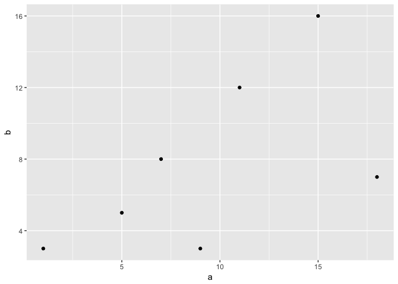

# 5_31_17_homework
Allie Gaudinier  
5/31/2017  

##10.5 Exercises

1. How can you tell if an object is a tibble? (Hint: try printing mtcars, which is a regular data frame). onlt the first 10 rows would print if it was a tibble.
print(mtcars)

2. Compare and contrast the following operations on a data.frame and equivalent tibble. What is different? Why might the default data frame behaviours cause you frustration? Depending on how much data you ask for a dataframe will give you a vector (one column) or a df (mutliple columns)


```r
library(tidyverse)
```

```
## Loading tidyverse: ggplot2
## Loading tidyverse: tibble
## Loading tidyverse: tidyr
## Loading tidyverse: readr
## Loading tidyverse: purrr
## Loading tidyverse: dplyr
```

```
## Conflicts with tidy packages ----------------------------------------------
```

```
## filter(): dplyr, stats
## lag():    dplyr, stats
```

```r
df <- data.frame(abc = 1, xyz = "a")
df$x
```

```
## [1] a
## Levels: a
```

```r
df[, "xyz"]
```

```
## [1] a
## Levels: a
```

```r
df[, c("abc", "xyz")]
```

```
##   abc xyz
## 1   1   a
```

```r
df[,1:2]
```

```
##   abc xyz
## 1   1   a
```


```r
df2 <- tibble(abc = 1, xyz = "a")
df2$x
```

```
## Warning: Unknown column 'x'
```

```
## NULL
```

```r
df2[, "xyz"]
```

```
## # A tibble: 1 × 1
##     xyz
##   <chr>
## 1     a
```

```r
df2[, c("abc", "xyz")]
```

```
## # A tibble: 1 × 2
##     abc   xyz
##   <dbl> <chr>
## 1     1     a
```


3. If you have the name of a variable stored in an object, e.g. var <- "mpg", how can you extract the reference variable from a tibble?

mpg[var]
mpg[[var]]
mpg[,var]
get(var, mpg)
select(mpg, matches(var))
subset(mpg, select= var)


4. Practice referring to non-syntactic names in the following data frame by:
  Extracting the variable called 1.
  

```r
testt <- tibble(
  `a` = c(1,5,7,9,11,15,18),
  `b` = c(3,5,8,3,12,16,7)
)

testt[["a"]]
```

```
## [1]  1  5  7  9 11 15 18
```


Plotting a scatterplot of 1 vs 2.

```r
library(ggplot2)
ggplot(testt, aes(x = `a`, y = `b` )) +
 geom_point()
```

<!-- -->


Creating a new column called 3 which is 2 divided by 1.


```r
testt[["c"]] <- testt[["a"]] + testt[["b"]]
```


Renaming the columns to one, two and three.

```r
testt <- rename(testt, one = `a`, two = `b`, three = `c`)
glimpse(testt)
```

```
## Observations: 7
## Variables: 3
## $ one   <dbl> 1, 5, 7, 9, 11, 15, 18
## $ two   <dbl> 3, 5, 8, 3, 12, 16, 7
## $ three <dbl> 4, 10, 15, 12, 23, 31, 25
```


5. What does tibble::enframe() do? When might you use it?
?enframe()
A helper function that converts named atomic vectors or lists to two-column data frames. For unnamed vectors, the natural sequence is used as name column.


```r
enframe(c(x =1, y =2, z = 12))
```

```
## # A tibble: 3 × 2
##    name value
##   <chr> <dbl>
## 1     x     1
## 2     y     2
## 3     z    12
```

6. What option controls how many additional column names are printed at the footer of a tibble?
?print.tbl_df
n_extra	: Number of extra columns to print abbreviated information for, if the width is too small for the entire tibble. If NULL, the default, will print information about at most tibble.max_extra_cols extra columns.
