# Untitled
Allie Gaudinier  
5/2/2017  

## May 3rd Homework

###Exercises 3.6.1

```
1.  
    geom for line chart: geom_line()
    geom for boxplot: geom_boxplot()
    geom for histogram: geom_bar()
    geom for area chart: geom_area()
```

```r
#2. This code will plot the points for all the cars data and create a trend line for each 
#type of drive
library(ggplot2)
ggplot(data = mpg, mapping = aes(x = displ, y = hwy, color = drv)) + 
  geom_point() + 
  geom_smooth(se = FALSE)
```

<!-- -->

```r
#3. show.legend = FALSE will take the legend away from the plot
ggplot(data = mpg, mapping = aes(x = displ, y = hwy, color = drv)) + 
  geom_point(show.legend = FALSE) + 
  geom_smooth(se = FALSE, show.legend = FALSE)
```

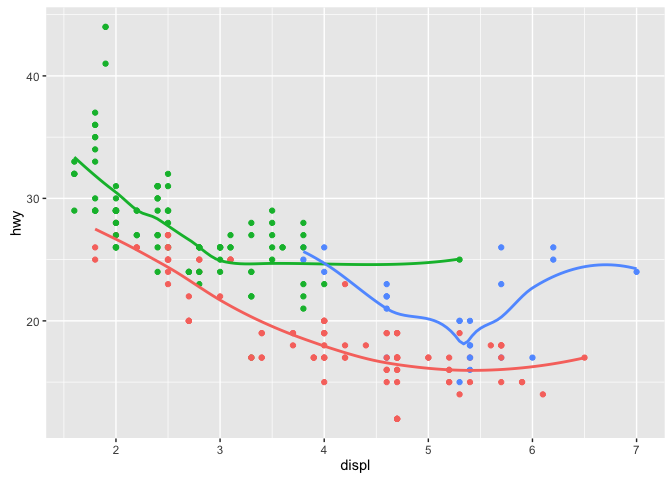<!-- -->

```r
#4. se - display confidence interval around smooth? (TRUE by default, see level to control
#?geom_smooth()

#5. These plot are the same - the aes are specified in the ggplot function or the geom functions
ggplot(data = mpg, mapping = aes(x = displ, y = hwy)) + 
  geom_point() + 
  geom_smooth()
```

<!-- -->

```r
ggplot() + 
  geom_point(data = mpg, mapping = aes(x = displ, y = hwy)) + 
  geom_smooth(data = mpg, mapping = aes(x = displ, y = hwy))
```

<!-- -->

```r
#6. 
#plot 1
ggplot(data = mpg, mapping = aes(x = displ, y = hwy)) + 
  geom_point(show.legend = FALSE) + 
  geom_smooth(se = FALSE, show.legend = FALSE)
```

<!-- -->

```r
#plot 2
ggplot(data = mpg, mapping = aes(x = displ, y = hwy)) + 
  geom_point(show.legend = FALSE) + 
  geom_smooth((mapping = aes(group = drv, show.legend = FALSE)), se = FALSE)
```

<!-- -->

```r
#plot 3
ggplot(data = mpg, mapping = aes(x = displ, y = hwy, color = drv)) + 
  geom_point() + 
  geom_smooth((mapping = aes(group = drv)), se = FALSE)
```

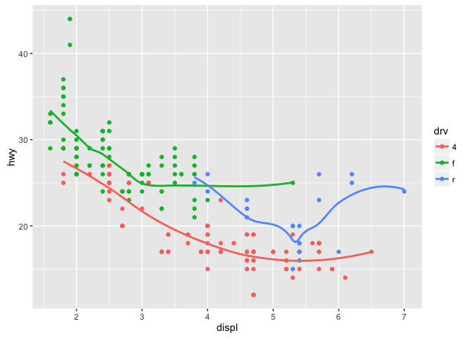<!-- -->

```r
#plot 4
ggplot(data = mpg, mapping = aes(x = displ, y = hwy)) + 
  geom_point(mapping = aes(color = drv)) + 
  geom_smooth(show.legend = FALSE, se = FALSE)
```

<!-- -->

```r
#plot 5
ggplot(data = mpg, mapping = aes(x = displ, y = hwy)) + 
  geom_point(mapping = aes(color = drv)) + 
  geom_smooth(mapping = aes(group = drv, linetype = drv), se = FALSE, show.legend = TRUE)
```

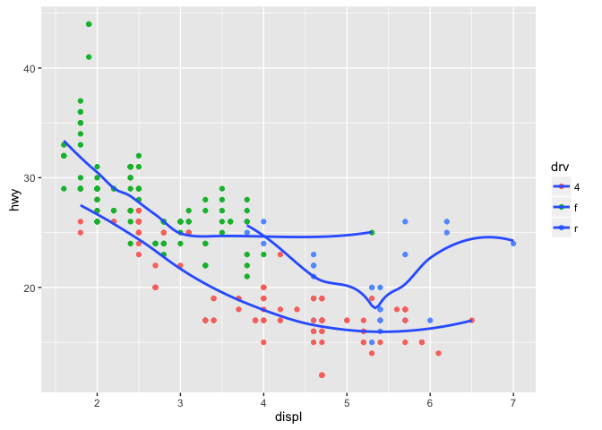<!-- -->

```r
#plot 6
ggplot(data = mpg, mapping = aes(x = displ, y = hwy)) +
  geom_point(size = 3, shape = 21, stroke = 3, color = "white", mapping = aes(fill = drv))
```

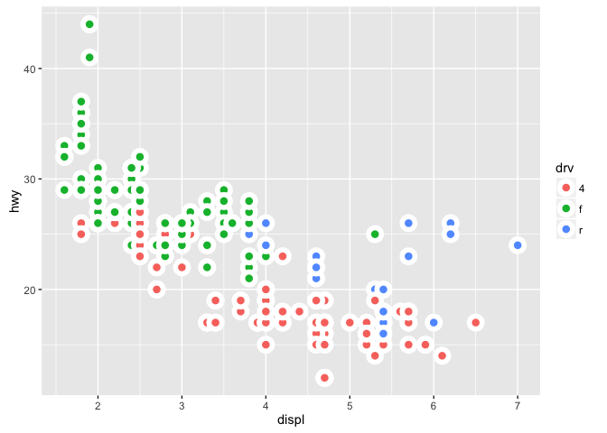<!-- -->

###3.7.1 Exercises


```r
#1. #?stat_summary - works with geom_pointrange
#This produces a boxplot type plot with distributions that can be marked
ggplot(data = mpg, aes(drv, cyl)) + 
  stat_summary()
```

```
## No summary function supplied, defaulting to `mean_se()
```

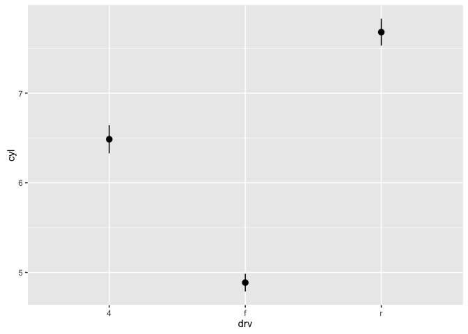<!-- -->
```
2. What does geom_col() do? How is it different to geom_bar()?
geom_col() is short-hand for geom_bar(stat = "identity")
geom_bar() is for bar plots

3. Most geoms and stats come in pairs that are almost always used in concert. Read through the documentation and make a list of all the pairs. What do they have in common?
#on this website :http://sape.inf.usi.ch/quick-reference/ggplot2/geom


4. What variables does stat_smooth() compute? What parameters control its behaviour?
computes a trendline using lm or glm

5. In our proportion bar chart, we need to set group = 1. Why? In other words what is the problem with these two graphs?
These graphs show the proportion of diamonds per category but not proportion per total number of diamonds per category
```

```r
ggplot(data = diamonds) + 
  geom_bar(mapping = aes(x = cut, y = ..prop.., group = 1))
```

<!-- -->

```r
ggplot(data = diamonds) + 
  geom_bar(mapping = aes(x = cut, fill = color, y = ..prop.., group = 1))
```

<!-- -->

###3.8.1 Exercises
```
1. What is the problem with this plot? How could you improve it?
There isn't much data - label the types of cars. Also, not showing all the points
```

```r
ggplot(data = mpg, mapping = aes(x = cty, y = hwy, color = class)) + 
  geom_point() +
  geom_jitter()
```

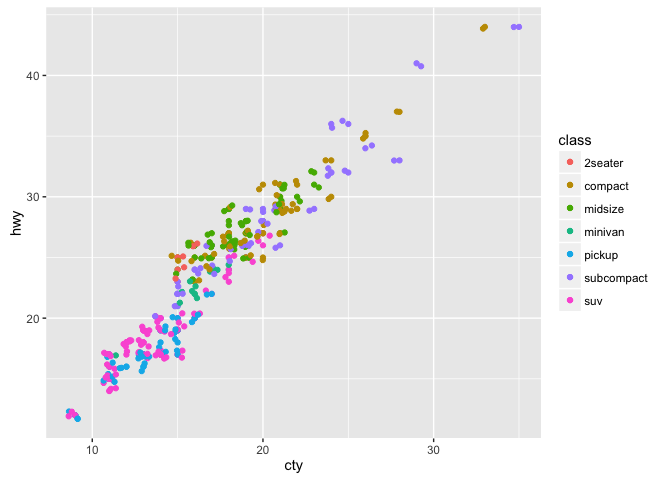<!-- -->

```
2. What parameters to geom_jitter() control the amount of jittering?
It adds a small amount of random variation to the location of each point, and is a useful way of handling overplotting caused by discreteness in smaller datasets. Width and height: 
Amount of vertical and horizontal jitter. The jitter is added in both positive and negative directions, so the total spread is twice the value specified here.

?geom_jitter()

3. Compare and contrast geom_jitter() with geom_count().
geom_count increases the size of a datapoint if there are multiple counts for that exact point
```

```r
ggplot(data = mpg, mapping = aes(x = cty, y = hwy, color = class)) + 
  geom_point() +
  geom_jitter()
```

<!-- -->

```r
  ggplot(data = mpg, mapping = aes(x = cty, y = hwy, color = class)) + 
  geom_point() +
  geom_count()
```

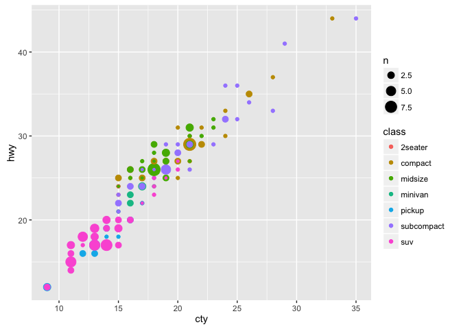<!-- -->

```
4. What’s the default position adjustment for geom_boxplot()? Create a visualisation of the mpg dataset that demonstrates it.The default position is stacked
```

```r
ggplot(data = mpg, mapping = aes(x = class, y = displ)) + 
  geom_boxplot()
```

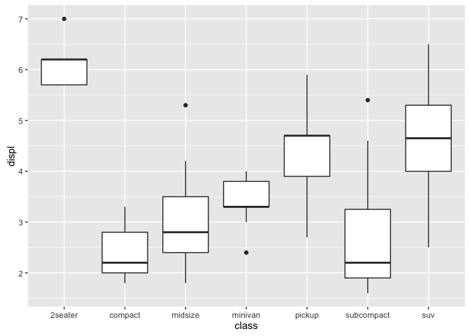<!-- -->

###3.9.1 Exercises
```
1.Turn a stacked bar chart into a pie chart using coord_polar().
```

```r
ggplot(data = mpg, mapping = aes(x = class, fill = drv)) + 
  geom_bar() +
  coord_polar()
```

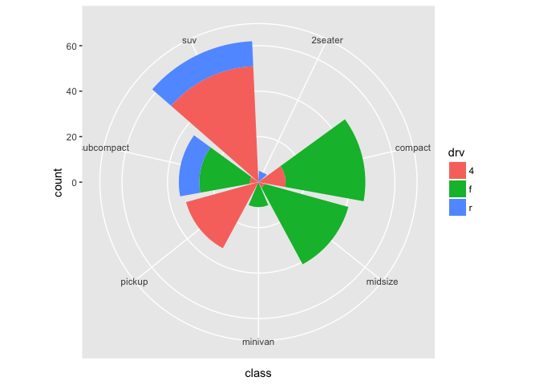<!-- -->

```
2. What does labs() do? Read the documentation. 
?labs()
Change axis labels and legend titles

3. What’s the difference between coord_quickmap() and coord_map()?
?coord_quickmap() -  a quick approximation that does preserve straight lines. It works 
best for smaller areas closer to the equator
?coord_map() - projects a portion of the earth, which is approximately spherical, onto 
a flat 2D plane using any projection

4. What does the plot below tell you about the relationship between city and highway mpg? 
Why is coord_fixed() important? What does geom_abline() do?'
?geom_abline() - These paired geoms and stats add straight lines to a plot, either horizontal, 
vertical or specified by slope and intercept
?coord_fixed() - A fixed scale coordinate system forces a specified ratio between the 
physical representation of data units on the axes. The ratio represents the number of units 
on the y-axis equivalent to one unit on the x-axis.
```

```r
ggplot(data = mpg, mapping = aes(x = cty, y = hwy)) +
  geom_point() + 
  geom_abline() +
  coord_fixed()
```

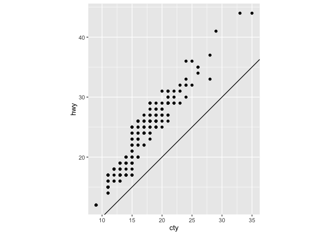<!-- -->

###4.4 Practice
```
1.Why does this code not work?
Spelling error

2. Errors fixed:
library(tidyverse)

ggplot(data = mpg) + 
  geom_point(mapping = aes(x = displ, y = hwy))

filter(mpg, cyl == 8)
filter(diamonds, carat > 3)


3. Alt + shift + k opens references for keyboard shortcuts
```

### Plot my own data

```
Load data for root system architecture measuremens
```

```r
Set1 = read.table("~/Desktop/RootPhenotyping/Final_Combined_Analysis/TDNA_40a.txt", header=T)
Roots1 = data.frame(Set1, stringsAsFactors=TRUE )
head(Roots1)
```

```
##   Plate NO3_Level Experiment Genotype Edge   PR LR    LRL    TRL      ALRL
## 1   1_1  limiting          a    Col-0   no 8.11 20 13.360 21.470 0.6680000
## 2   1_1  limiting          a  TDNA_40   no 7.83 16  9.252 17.082 0.5782500
## 3  1_10  limiting          a    Col-0  yes 7.34 16  6.002 13.342 0.3751250
## 4  1_10  limiting          a  TDNA_40   no 7.15 16  8.901 16.051 0.5563125
## 5  1_11  limiting          a    Col-0   no 8.27 24 12.378 20.648 0.5157500
## 6  1_11  limiting          a  TDNA_40  yes 7.57 16  9.503 17.073 0.5939375
##         LRD LRL_div_TRL Plant     logPR    logLR    logLRL   logTRL
## 1 0.4055000   0.6222636     1 0.9090209 1.301030 1.1258065 1.331832
## 2 0.4893750   0.5416228     2 0.8937618 1.204120 0.9662356 1.232539
## 3 0.4587500   0.4498576     3 0.8656961 1.204120 0.7782960 1.125221
## 4 0.4468750   0.5545449     4 0.8543060 1.204120 0.9494388 1.205502
## 5 0.3445833   0.5994769     5 0.9175055 1.380211 1.0926505 1.314878
## 6 0.4731250   0.5566099     6 0.8790959 1.204120 0.9778607 1.232310
##      logALRL     logLRD logLRL_div_TRL
## 1 -0.1752235 -0.3920091     -0.2060256
## 2 -0.2378844 -0.3103582     -0.2663031
## 3 -0.4258240 -0.3384239     -0.3469249
## 4 -0.2546812 -0.3498139     -0.2560633
## 5 -0.2875608 -0.4627057     -0.2222275
## 6 -0.2262593 -0.3250241     -0.2544491
```

```
Make boxplots for the data at 1mM and 10mM nitrate compared to Col-0
```

```r
#PR Length
ggplot (data = Roots1, mapping = aes( x = NO3_Level, y = logPR, fill = Genotype)) +
  #geom_violin(position = position_dodge(width=0.9), alpha = 0.5) +
  geom_boxplot(position = position_dodge(width=0.9)) +
  geom_point(position=position_jitterdodge(dodge.width=0.9))
```

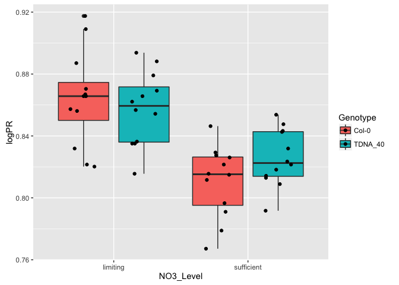<!-- -->

```r
#LR number
  ggplot (data = Roots1, mapping = aes( x = NO3_Level, y = logLR, fill = Genotype)) +
  #geom_violin(position = position_dodge(width=0.9), alpha = 0.5) +
  geom_boxplot(position = position_dodge(width=0.9)) +
  geom_point(position=position_jitterdodge(dodge.width=0.9))
```

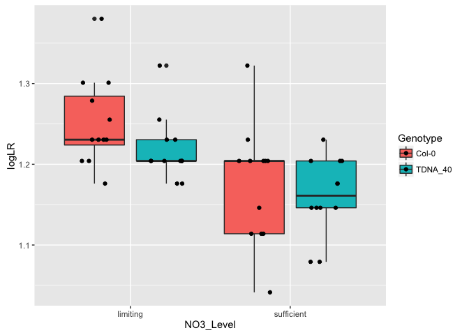<!-- -->

```r
  #geom_count(position=position_jitterdodge(dodge.width=0.9))
  
  #Total LRL
  ggplot (data = Roots1, mapping = aes( x = NO3_Level, y = logLRL, fill = Genotype)) +
  #geom_violin(position = position_dodge(width=0.9), alpha = 0.5) +
  geom_boxplot(position = position_dodge(width=0.9)) +
  geom_point(position=position_jitterdodge(dodge.width=0.9))
```

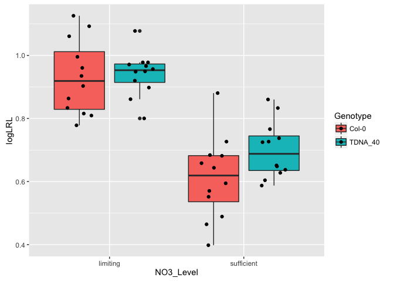<!-- -->

```r
  #geom_count(position=position_jitterdodge(dodge.width=0.9))
```
  
  ```
  make plots as object and then arrange them next to eachother
  use grid.arrage to combine two plots side by side - can specify width of both plots
  can use cow plot to plot things side by side too
  
  
  ```
